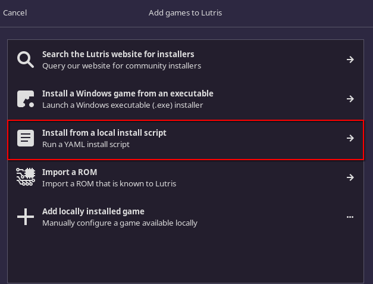
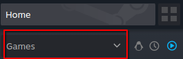

# Ashes of Creation Lutris Script


This script is a fork from the existing script on Lutris.net. I added some crucial pieces to getting the launcher working properly. Previously, you could not see the login page in the launcher and the captcha was a blank screen as well. After a full day of following a forum thread, I pieced together the things people did to get certain parts working and then I placed them in this script. 

## Important!

Launching the game from the launcher does not work for reasons speculated to do with authenication and Easy Anti-cheat.Each time you open the launcher and login, the authenication port changes which appears to not get passed to the client. Therefore in order to allow the game to reach the server you have to launch it from steam so it can use Easy Anti-cheat properly and also add launch options that include a one line command that captures the random port each time you launch the game. 

## instructions
note: Make sure you have Wine installed either through Lutris or your package manager. The newer versions of Wine work best but Proton-GE is what I used which you can download with a tool called "protonup-qt" which is a flatpak

1. Open Lutris and click the + button


2. Then select the optio nto install via script


3. Follow the instructions carefully and let the install lutris install wizard do it's thing before closing it. 

4. Open the launcher from the newly created Ashes of Creation Library entry

5. Login to your AOC account and let the game install. Once it's finished, then leave the launcher open.

6.. Open Steam and at the bottom left corner, add a non-steam game and then click browse at the bottom left corner of the list

7. Navigate to the AOC client directly which is located in:
/home/your_system_user_here/Games/ashes-of-creation/ashes-of-creation/drive_c/Program Files/Intrepid Studios/AshesOfCreation/PROD/AOCClient.exe

8. Once the AOCClient.exe is in your steam library, right click on it and go to properties.

9. On the shortcut page of properties, add the following in the launch options:
```bash
eval $(%command% LauncherTetherPort=$(ss -ulpn | grep wineserv | awk '{split($4, a , ":"); print a[2]}' ) -NOSPLASH -USEEOS=0)
```
Note, the above will find the random port from the launcher if the launcher is open.

10. Make sure EAC Proton is installed in steam. Filter tyou Steam library to show tools.

Then search for easyanticheat and install "Proton EasyAntiCheat Runtime"

11. Go back to AOCClient.exe in your steam library and click play and you are done. The character selection screen should load up and you are good to go.
